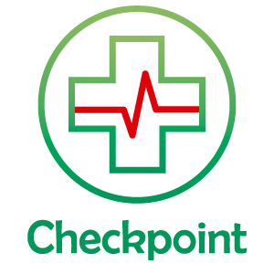

--------------------------------------------------------------------

## 📖 Projeto Checkpoint - Paciente App

O Checkpoint é uma solução que centraliza os dados do paciente no Blockchain através de um Smart Contract retirando estes dados das mãos das operadoras para o paciente. No entanto, este compartilhará os dados com as operadoras e profissionais da saúde para que a prestação do serviço seja eficiente e assim a relação é mais justa e dinâmica, evitando também perda e reinserção de dados.

## 🚀 Utilização

<h3>Desenvolvido em Flutter</h3>
<ul>
	<li>Utilizamos o infura para criar a conexão RPC</li>
	<li>Utilizamos as APIS de QRCode e WEB3 para ler os dados do paciente e registrar no blockchain</li>
	<li>O ABI do contrato pode ser encontrado em `assets/standardToken.json`</li>
</ul>

## Integrações com apis

<h3>Api da Gr1d</h3>
<ul>
	<li>Validação do usuário por meios dos dados informados</li>
</ul>

<h3>Api da twilio</h3>
<ul>
	<li>Validação de Código de seguração do cadastro por sms</li>
</ul>

## ✍ Autores

👤 **Victor Bilis**

* Github: [@victorbilisambipar](https://github.com/victorbilisambipar)

👤 **Paulo Victor**

* Github: [@paulovictorBraw](https://github.com/paulovictorBraw)

👤 **Felipe Candian**

* Github: [@felipecandian]( https://github.com/felipecandian)

👤 **Bruno Eleodoro**

* Github: [@BrunoEleodoro]( https://github.com/BrunoEleodoro)

👤 **Rodrigo Temoteo**

* Github: [@rodrigoatemoteo]( https://github.com/rodrigoatemoteo)

## 📝 Licença

Copyright © 2020 Checkpoint 

***

